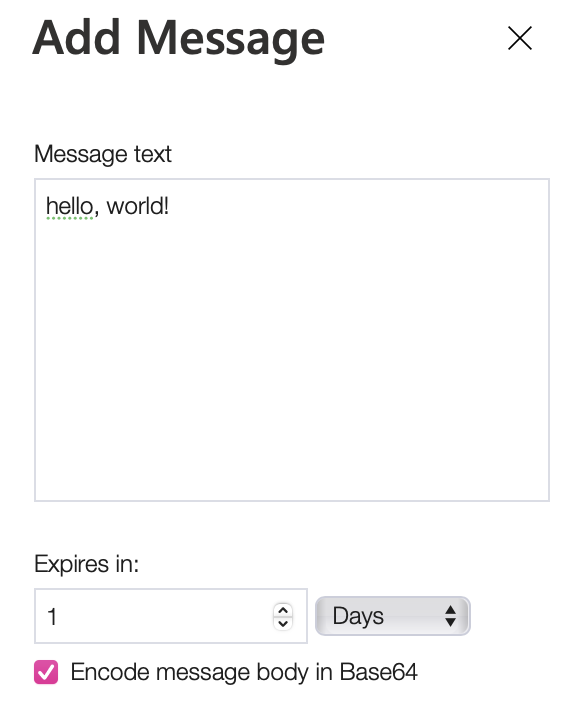
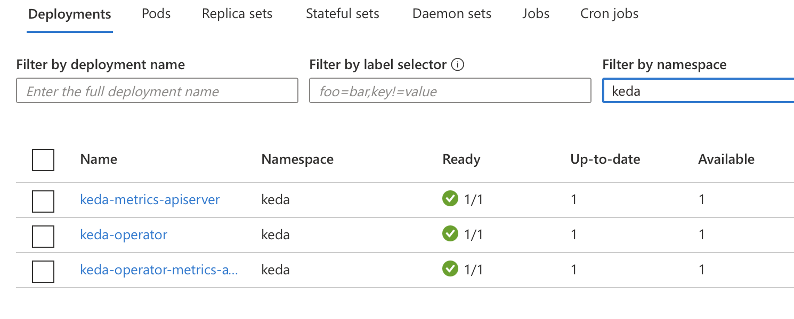
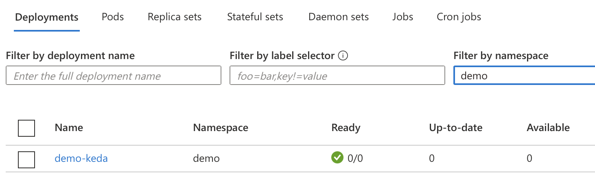

# KEDA and Azure Functions, using dotnet core,  with Azure storage queues sample

This sample goes through the basics of creating an Azure Function that triggers on a new Azure Storage Queue message.  The function can then be deployed to Kubernetes with KEDA for event driven activation and scale.

## Pre-requisites

* [Azure Function Core Tools v3](https://github.com/azure/azure-functions-core-tools#installing). 
* An Azure Subscription (to host the storage queue)
* An Azure Storage account with the queue "myqueue-items"
* Kubernetes cluster (Azure AKS with RBAC)
* Docker and a Docker registry (Azure Container Registry)
* Dotnet Core 3.1

## Tutorial

#### 1. Create a new directory for the function app

```cli
mkdir demo-keda
cd demo-keda
```

#### 2. Initialize the directory for functions

```cli
func init --worker-runtime dotnet --docker
```

#### 3. Add a new queue triggered function with the name `Demo`

```cli
func new -n Demo -l C#
```

Select **QueueTrigger**


#### 4. Update the local settings file with the storage account info


Open `local.settings.json` which has the local debug connection string settings.  Replace the `{AzureWebJobsStorage}` with the connection string value for your Azure Storage account:

**local.settings.json**
```json
{
  "IsEncrypted": false,
  "Values": {
    "FUNCTIONS_WORKER_RUNTIME": "dotnet",
    "AzureWebJobsStorage": "<YOUR CONNECTION STRING>"
  }
}
```

#### 5. Update the function file with the connection info


Open `Demo.cs` and update `Connection = ""` with the connection string value for your Azure Storage account:

**local.settings.json**
```csharp
[FunctionName("Demo")]
        public static void Run([QueueTrigger("myqueue-items", Connection = "AzureWebJobsStorage")]string myQueueItem, ILogger log)
        {
            log.LogInformation($"C# Queue trigger function processed: {myQueueItem}");
        }
```


#### 6. Debug and test the function locally (optional)

Start the function locally
```cli
func start
```

Go to your Azure Storage account in the [Azure Portal](https://portal.azure.com) and open the **Storage Explorer**.  Select the `myqueue-items` queue and add a message to send to the function.



After the message has been added, you should see your function picking up the event:

```cli
[2021-01-10T10:05:08.733Z] Executing 'Demo' (Reason='New queue message detected on 'myqueue-items'.', Id=2fd43362-e584-46cd-a45f-c4851cd6a0c1)
[2021-01-10T10:05:08.734Z] Trigger Details: MessageId: 564208a2-c461-478d-b212-b1f3b617f7e4, DequeueCount: 1, InsertionTime: 01/10/2021 10:05:07 +00:00
[2021-01-10T10:05:08.744Z] C# Queue trigger function processed: hello, world!
[2021-01-10T10:05:08.757Z] Executed 'Demo' (Succeeded, Id=2fd43362-e584-46cd-a45f-c4851cd6a0c1, Duration=51ms)
```

#### 8. Install KEDA

[Follow the instructions](https://keda.sh/docs/2.0/deploy/) to deploy KEDA v 2.0 in your cluster.

To confirm that KEDA has successfully installed you can run the following command and should see the following CRD.

```cli
kubectl get customresourcedefinition 

scaledobjects.keda.k8s.io                          2020-12-18T09:36:29Z
scaledobjects.keda.sh                              2021-01-07T17:29:54Z
```

and/or check in your kubernetes cluster (Azure example), that the following deployments are active:




#### 9. Create Docker image and publish it to your container registry

Let's name our image `demo-keda` and create local docker image:

```cli
docker build -t <your registry name>.azurecr.io/demo-keda .
```

And push it to the registry

```cli
docker push <your registry name>.azurecr.io/demo-keda:latest
```


#### 10. Create kubernetes deployment file

Generate a deployment yaml for the kubernetes' namespace `demo`:

```cli
func kubernetes deploy --name demo-keda --namespace demo \
  --image-name <your registry name>.azurecr.io/demo-keda:latest --dry-run > deploy.yaml 
```

Func will generate KEDA v 1.0 yaml files, so we would need to fine-tune it.

Open `deploy.yaml` and replace the last section (ScaledObject) with this one:

```yaml
apiVersion: keda.sh/v1alpha1
kind: ScaledObject
metadata:
  name: demo-keda
  namespace: demo
spec:
  scaleTargetRef:
    name: demo-keda
  cooldownPeriod:  180
  minReplicaCount: 0
  maxReplicaCount: 2
  advanced:
    restoreToOriginalReplicaCount: true
  triggers:
  - type: azure-queue
    metadata:
      connectionFromEnv: AzureWebJobsStorage
      queueName: myqueue-items
      queueLength: '1'
```


..and apply the deployment to your cluster.
```cli
kubectl apply -f deploy.yaml
```

This is how it looks in the Azure Kubernetes cluster:



#### 10. Add a queue message and validate the function app scales with KEDA

Initially after deploy and with an empty queue you should see 0 pods running.

```cli
kubectl get pods -n demo 
```

By default, for a ScaledObject a `pollingInterval` equals 30 seconds, and `cooldownPeriod` equals 300 seconds, meaning that the queue will be polled each 30 seconds and your active scaled object (job) would be stopped in 5 minutes, if there are no messages in the queue. In our fine-tuning we have set queueLength to 1, so the auto-autoscaling should be triggred on average for each queue message. Be default, the value is 5.

Start watching the auto-scaling:

```cli
kubectl get pods -w
```

Add 5-10 queue message to the queue. KEDA will detect the event and add a pod.  

```cli
NAME                        READY   STATUS    RESTARTS   AGE
demo-keda-59b677fdd-5qchq   0/1     Pending   0          0s
demo-keda-59b677fdd-5qchq   0/1     Pending   0          0s
demo-keda-59b677fdd-5qchq   0/1     ContainerCreating   0          0s
demo-keda-59b677fdd-5qchq   1/1     Running             0          2s
```


## Cleaning up resources

#### Delete the function deployment

```cli
kubectl delete deploy demo-keda -n demo
kubectl delete ScaledObject demo-keda -n demo
kubectl delete Secret demo-keda -n demo

```
